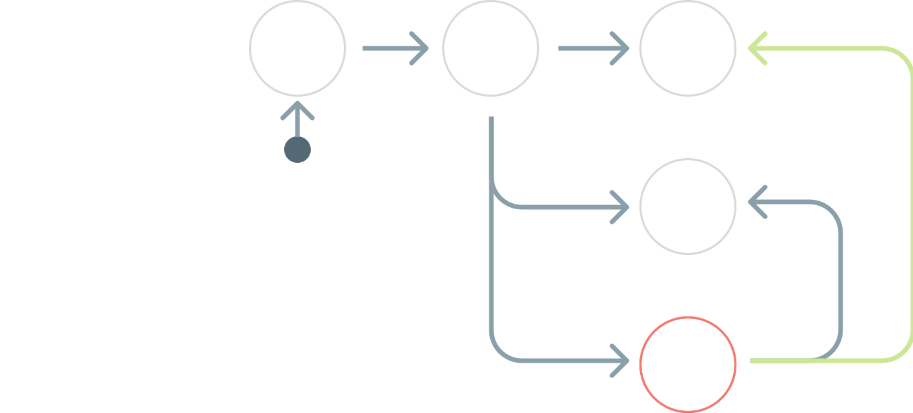
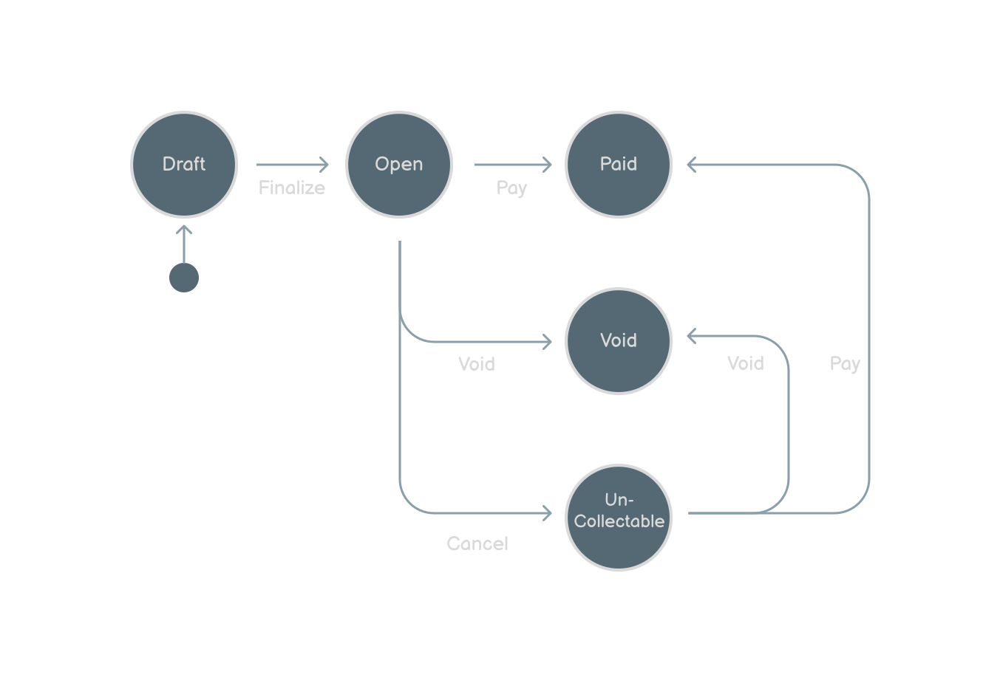

### Links

[See Slides on SpeakerDeck](https://speakerdeck.com/jacobbennett/state-machines-in-laravel)

[Watch Talk on Youtube](https://www.youtube.com/watch?v=1A1xFtlDyzU&ab_channel=Laravel)

### Resources

Thanks so much for your interest in my State Machines talk.

Know that this codebase should be used as a reference only and not as a working prototype. There are a good number of places in this codebase that provide non-implemented pseudo-code examples for your reference. 

Please use this only as a way to remember what the ideas discussed during the talk were.

The main locations to pay attention to are:

- [`app/Http/Controllers/*`](app/Http/Controllers)
- [`app/StateMachines/Invoice/*`](app/StateMachines/Invoice)
- [`app/Enums/*`](app/Enums)

